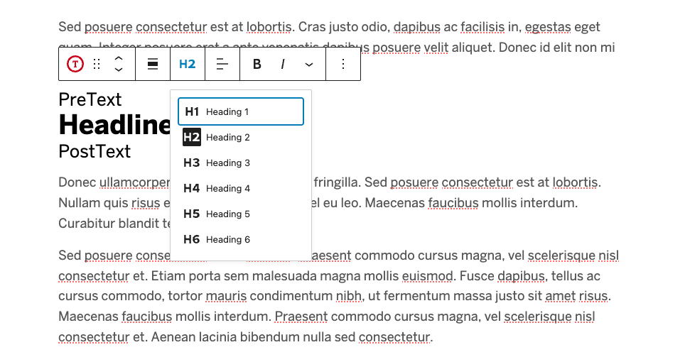

# Headline Block

A WordPress block for creating heading elements (h1-h6) with enhanced styling options, pre-text, and post-text support.

## Example



## Features

- Support for all heading levels (H1-H6)
- Optional pre-text and post-text formatting
- Multiple style variations (emphasis-weight, emphasis-color)
- Text alignment options
- Color Support
- Dynamic block rendering

## Block Supports

By default the block supports WordPress Core Color Block Supports. Theme.json can be used to control the color settings:

```json
"color": {
    "text": true,
    "background": true,
    "link": true,
    "gradients": true
},
```

## Usage

### Basic Example

```jsx
<!-- Basic headline -->
<h2 class="wp-block-editorial-headline">
    Welcome to Boston University
</h2>

<!-- With pre-text and post-text -->
<h2 class="wp-block-editorial-headline">
    <span class="wp-block-editorial-headline-pretext">Chapter 1:</span>
    Course Overview
    <span class="wp-block-editorial-headline-posttext">(Fall 2025)</span>
</h2>
```

### Style Variations

```jsx
<!-- Emphasis Weight Style -->
<h2 class="wp-block-editorial-headline is-style-emphasis-weight">
    <strong>Research</strong> Methods
</h2>

<!-- Emphasis Color Style -->
<h2 class="wp-block-editorial-headline is-style-emphasis-color">
    Data <strong>Analysis</strong>
</h2>
```

## Components

### HeadingLevelToolbar

The block uses the HeadingLevelToolbar component for heading level selection. See the [HeadingLevelToolbar documentation](/src/blocks/_includes/components/HeadingLevelToolbar/Readme.md) for detailed component usage.

```jsx
<HeadingLevelToolbar
    value={attributes.level}
    onChange={(newLevel) => setAttributes({ level: newLevel })}
/>
```

## Block Attributes

| Name       | Type     | Default | Description                    |
|------------|----------|---------|--------------------------------|
| `level`    | number   | 2       | Heading level (1-6)           |
| `content`  | string   | ''      | Main heading text             |
| `preText`  | string   | ''      | Text before main content      |
| `postText` | string   | ''      | Text after main content       |
| `align`    | string   | ''      | Text alignment                |

## ToDo

- Add support for custom HTML anchor IDs
- Implement spacing Block Support?
- Add block patterns for common use cases

## Changelog

### 2.0.0
- Breaking Changes:
  - Changed block rendering from static to dynamic
- Added support for core `Color` Block Support
- Added text alignment support
- Added Block Alignment Support
- Refactored block structure to modernize
  - Moved attributes to default locations
  - Added deprecations for markup changes
- Converted to dynamic block using render.php
- Added migration support for static blocks

### 1.0.0
- Initial release
- Static block implementation
- Basic heading level support
- Pre-text and post-text functionality